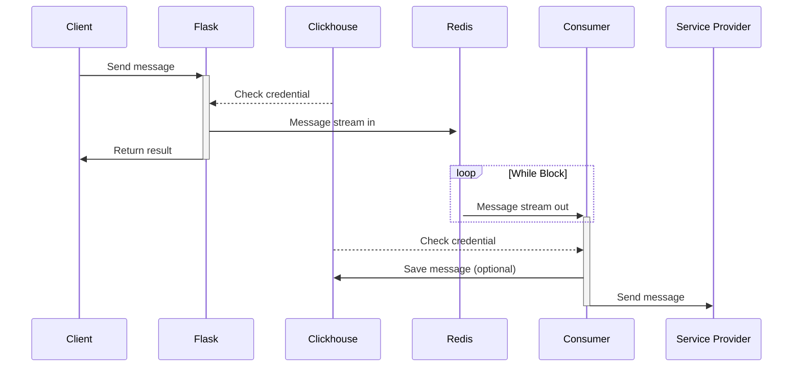

# Pipe Message Distributor


[](https://github.com/LittleJake/pipe-message-distributor/actions/workflows/codeql-analysis.yml)


基于Python、Flask、ClickHouse、Redis的消息管道推送服务，类似产品为Bark、Server酱。


## 服务结构图




## 推送服务接入情况

| 服务       | 接入情况 | 网址                                                         |
| ---------- | -------- | ------------------------------------------------------------ |
| Google FCM | √        | [Firebase Cloud Messaging](https://firebase.google.com/docs/cloud-messaging) |
| Bark       | √        | -                                                            |
| Wxwork     | √        | [发送应用消息](https://developer.work.weixin.qq.com/document/path/90236) |
| Telegram   | √        | [Telegram Bot API](https://core.telegram.org/bots/api)       |
| MQTT       | TODO     | -                                                            |
| APN        | TODO     | [Sending Notification Requests to APNs - Apple Developer](https://developer.apple.com/documentation/usernotifications/setting_up_a_remote_notification_server/sending_notification_requests_to_apns/) |
| Email      | TODO     | [Mailgun: Transactional Email API Service For Developers](https://www.mailgun.com/) |

## 修改测试数据

1. 编辑`./sql/test.sql`文件内相关token数据即可

2. 添加FCM服务端token的json文件时，放置于本目录以及`./build/consumer`目录下，命名为`fcm_token.json`。


## 测试效果参考

[（挖坑）搭建消息推送api](https://blog.littlejake.net/archives/596/)


## 部署方式

### Docker Compose部署

```bash
git clone https://github.com/LittleJake/pipe-message-distributor.git

cd pipe-message-distributor/

docker-compose up --build
```


### 裸机部署（未测试）

#### Debian / Ubuntu

```bash
git clone https://github.com/LittleJake/pipe-message-distributor.git

cd pipe-message-distributor/

# 安装ClickHouse（务必关闭外部访问）
sudo apt-get install -y apt-transport-https ca-certificates dirmngr
sudo apt-key adv --keyserver hkp://keyserver.ubuntu.com:80 --recv 8919F6BD2B48D754

echo "deb https://packages.clickhouse.com/deb stable main" | sudo tee \
    /etc/apt/sources.list.d/clickhouse.list
sudo apt-get update

sudo apt-get install -y clickhouse-server clickhouse-client

sudo service clickhouse-server start

# 安装依赖

sudo apt-get install -y python3-pip python38
sudo python38 -m pip install -r requirements.consumer.txt
sudo python38 -m pip install -r requirements.server.txt

# 安装Redis

sudo apt-get install -y redis=6.2.6

redis-server --daemonize yes --appendonly off --save ""

# 导入初始数据库

clickhouse-client < ./sql/init.sql

# 测试数据导入（可选）
clickhouse-client < ./sql/test.sql

# 运行服务
nohup python38 main.py &> ./main.log &
nohup python38 consumer.py &> ./consumer.log &


```

#### CentOS

```bash
git clone https://github.com/LittleJake/pipe-message-distributor.git

cd pipe-message-distributor/

# 安装ClickHouse（务必关闭外部访问）
sudo yum install -y yum-utils
sudo yum-config-manager --add-repo https://packages.clickhouse.com/rpm/clickhouse.repo
sudo yum install -y clickhouse-server clickhouse-client

sudo /etc/init.d/clickhouse-server start

# 安装依赖

sudo yum install -y python3-pip python38
sudo python38 -m pip install -r requirements.consumer.txt
sudo python38 -m pip install -r requirements.server.txt

# 安装Redis

sudo yum install -y redis=6.2.6

redis-server --daemonize yes --appendonly off --save ""

# 导入初始数据库

clickhouse-client < ./sql/init.sql

# 测试数据导入（可选）
clickhouse-client < ./sql/test.sql

# 运行服务
nohup python38 main.py &> ./main.log &
nohup python38 consumer.py &> ./consumer.log &


```

## API 文档

TODO


